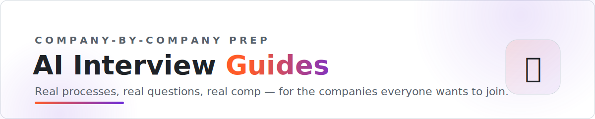

<picture>
  <source media="(prefers-color-scheme: dark)" srcset="assets/banner-dark.svg">
  
</picture>

   

**Deep, sourced interview guides for the AI companies everyone wants to join.**
Real processes stage by stage · real questions candidates reported · comp ranges · what gets people rejected.

[Frontier labs](#frontier-labs) · [Big tech AI orgs](#big-tech-ai-orgs) · [AI-native product companies](#ai-native-product-companies) · [AI infra & tooling](#ai-infra-tooling) · [Applied AI & forward-deployed](#applied-ai-forward-deployed)

---

> **How these are built** — each guide is compiled from hundreds of public candidate reports (Glassdoor, Blind, Reddit, interviewing.io, candidate blogs and X threads, 2024–2026), with every process claim and question cited to its source. Anecdote is labeled as anecdote. Processes change — if you interviewed recently, [a PR or issue](https://github.com/landedjobs/ai-interview-guides/issues) makes the guide better for the next person. ⭐ **Star this repo** — guides get refreshed and new companies added.

## 🧪 Frontier labs

_The hardest loops in the industry — research taste, safety, and systems depth._

<table>
<tr><td align="center" valign="top" width="33%"> <b><a href="guides/openai.md">OpenAI</a></b> One of the fastest loops among frontier labs, sometimes two weeks start to finish, testing whether you can architect full-stack AI systems at massive …</td><td align="center" valign="top" width="33%"> <b><a href="guides/anthropic.md">Anthropic</a></b> The longest loop of the six frontier labs (7-9 rounds), and the dedicated values round is a hard gate: mission mismatch is the most publicly …</td><td align="center" valign="top" width="33%"> <b><a href="guides/google-deepmind.md">Google DeepMind</a></b> The most research-flavored loop of the six frontier labs: paper discussions, math and theory rounds, banned AI tools, and a hiring committee that can …</td></tr>
<tr><td align="center" valign="top" width="33%"> <b><a href="guides/meta-ai.md">Meta AI</a></b> The only frontier lab that runs two dedicated ML system design rounds in one loop, and the 2026 bar is tighter than the 2025 hiring-spree era after …</td><td align="center" valign="top" width="33%"> <b><a href="guides/xai.md">xAI</a></b> The fastest and most practical loop of the six frontier labs, often under two weeks, screening hard for shipping intensity and in-person Bay Area …</td><td align="center" valign="top" width="33%"> <b><a href="guides/mistral.md">Mistral AI</a></b> A fast 3-5 week loop that is brutally selective (a reported ~22% pass rate), rewarding open-weight and open-source engineering over research pedigree.</td></tr>
</table>

## 🏢 Big tech AI orgs

_ML breadth/depth rounds, team matching, and the AI premium on comp._

<table>
<tr><td align="center" width="33%"> <b>Google</b> 🔜 guide in progress</td><td align="center" width="33%"> <b>Microsoft</b> 🔜 guide in progress</td><td align="center" width="33%"> <b>Amazon</b> 🔜 guide in progress</td></tr>
<tr><td align="center" width="33%"> <b>Apple AIML</b> 🔜 guide in progress</td><td align="center" width="33%"> <b>NVIDIA</b> 🔜 guide in progress</td><td align="center" width="33%"> <b>Tesla AI</b> 🔜 guide in progress</td></tr>
</table>

## ⚡ AI-native product companies

_Work trials, paid projects, and product-sense rounds — shipping beats puzzles._

<table>
<tr><td align="center" valign="top" width="33%"> <b><a href="guides/perplexity.md">Perplexity</a></b> A non-LeetCode Python screen, a 4-5 round loop, and a founder final that probes whether you actually use Perplexity and can prove "frontier …</td><td align="center" valign="top" width="33%"> <b><a href="guides/cursor.md">Cursor</a></b> Expect an AI-authenticity grilling on your .cursorrules, a paid 8-hour remote build, and a recruiter who asks up front if you'll accept six-day …</td><td align="center" valign="top" width="33%"> <b><a href="guides/scale-ai.md">Scale AI</a></b> A HackerRank hits your inbox the moment you apply, speed is graded openly, and interviewers tell you to your face the culture is "pretty like 996".</td></tr>
<tr><td align="center" valign="top" width="33%"> <b><a href="guides/harvey.md">Harvey</a></b> Heavy data-structure coding (R-trees, red-black rebalancing, min-cost flow) with running code expected, a reported ~20% pass rate, and a signature …</td><td align="center" valign="top" width="33%"> <b><a href="guides/glean.md">Glean</a></b> A reported ~3% pass rate, LeetCode medium/hard coding, and a 5-part table-module take-home where finishing 4 of 5 parts is the bar.</td><td align="center" valign="top" width="33%"> <b><a href="guides/sierra.md">Sierra</a></b> The AI-native loop: Plan, a 2-hour Build using the coding agents of your choice, then a Review that grades your agency, judgment, and path to …</td></tr>
<tr><td align="center" valign="top" width="33%"> <b><a href="guides/notion.md">Notion</a></b> A 24-72 hour block-editor take-home that the pair-programming round then extends live, capped by OT-vs-CRDT system design and a ~23% pass rate.</td></tr>
</table>

## 🔧 AI infra & tooling

_Distributed systems, inference economics, and open-source signal._

<table>
<tr><td align="center" width="33%"> <b>Databricks</b> 🔜 guide in progress</td><td align="center" width="33%"> <b>Hugging Face</b> 🔜 guide in progress</td><td align="center" width="33%"> <b>Together AI</b> 🔜 guide in progress</td></tr>
<tr><td align="center" width="33%"> <b>Groq</b> 🔜 guide in progress</td><td align="center" width="33%"> <b>LangChain</b> 🔜 guide in progress</td><td align="center" width="33%"> <b>Weights & Biases</b> 🔜 guide in progress</td></tr>
<tr><td align="center" width="33%"> <b>Pinecone</b> 🔜 guide in progress</td></tr>
</table>

## 🚀 Applied AI & forward-deployed

_Decomposition cases, customer scenarios, and practical rounds._

<table>
<tr><td align="center" valign="top" width="33%"> <b><a href="guides/palantir.md">Palantir</a></b> The most distinctive loop in tech: a mandatory decomposition round, a mission-fit debate, and a customer scenario sit alongside coding, system …</td><td align="center" valign="top" width="33%"> <b><a href="guides/ramp.md">Ramp</a></b> Build, don't puzzle: a CodeSignal Banking System OA, a hotel-reservation phone screen, then 4 practical onsite rounds - offers typically land 9 days …</td><td align="center" valign="top" width="33%"> <b><a href="guides/stripe.md">Stripe</a></b> Stripe's signature is troubleshooting plus integration: alongside algorithms, you debug a broken Stripe API flow and integrate a new payment method …</td></tr>
<tr><td align="center" valign="top" width="33%"> <b><a href="guides/snowflake.md">Snowflake</a></b> Snowflake over-indexes on databases and query internals: even general SWE loops ask SQL and schema design, and Cortex/AI roles probe …</td><td align="center" valign="top" width="33%"> <b><a href="guides/salesforce.md">Salesforce</a></b> MTS loops have pivoted toward Agentforce: 40+ AI questions on Agentforce, the Einstein Trust Layer, RAG, and Data 360 are now standard alongside …</td><td align="center" valign="top" width="33%"> <b><a href="guides/duolingo.md">Duolingo</a></b> ML here is applied, not research: expect "design a system to improve retention", OO pair programming, and a presentation round - product-ML framing …</td></tr>
<tr><td align="center" valign="top" width="33%"> <b><a href="guides/servicenow.md">ServiceNow</a></b> Scenario-based over live coding: workflow design, Glide scripting, and governed Now Assist/Otto AI agents dominate - "nothing as intense as …</td></tr>
</table>

---

## What's inside every guide

**1. Company AI context** — who's hiring and for what · **2. The loop, stage by stage** · **3. Real reported questions** (cited) · **4. Technical topics for this company** · **5. Design/practical round themes with worked outlines** · **6. Behavioral & culture** · **7. Compensation** · **8. What gets people rejected** · **9. Insider tips**

## Related

- ❓ [ai-interview-questions](https://github.com/landedjobs/ai-interview-questions) — the cross-company question banks with ideal answers
- 🚀 [ai-engineer-jobs](https://github.com/landedjobs/ai-engineer-jobs) — 300 live AI engineer roles, auto-updated
- 🧭 [awesome-ai-native-jobs](https://github.com/landedjobs/awesome-ai-native-jobs) — the umbrella for the whole family

---

**Reading about interviews isn't practicing them. [Landed](https://landed.jobs) runs voice mock interviews tuned to the company you're targeting — plus daily matched AI roles and agent-drafted application answers.**

Compiled from public candidate reports — not affiliated with any company listed. · maintained by <a href="https://landed.jobs">Landed</a>

